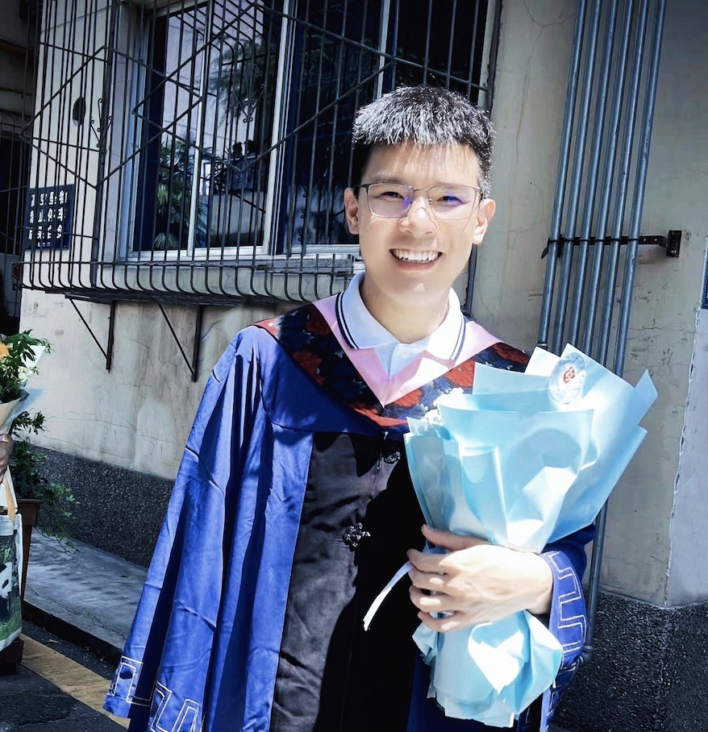

# About Me

Hi 👋 My name is **Gengyan (Kyan) Tang [Chinese name:唐耕砚]**. I am a incoming PhD student in the Werklund School of Education at the University of Calgary. Here is [my latest CV](CV-Gengyan.pdf). My research interests include research integrity, academic integrity, scholarly publishing, and higher education. Prior to my studies at the UCalgary, I lived in mainland China, where I was deeply concerned about the increasingly serious issue of research integrity, especially in the field of medicine, and has published some related papers. I currently serves as a peer reviewer for academic journals such as *Accountability in Research*, *Journal of Scholarly Publishing*, *Journal of Librarianship and Information Science*, and *BMC Medical Education*. I am also a student member of the Research Integrity and Responsible Innovation Professional Committee under the Chinese Association of Science of Science and S&T Policy Research. Additionally, I am the founder of the Chinese academic media *Journal Observer*, which publishes news on publishing ethics and research integrity. I also founded *The Digest Journal of Scholarly Publishing*, a bimonthly abstract journal that publishes outstanding papers on scholarly publishing, research integrity, academic integrity, and information science. 

## Research Interests

My research interests include exploring the impact of artificial intelligence tools on research integrity, the role of news media in integrity education, and how complex adaptive educational leadership addresses systemic challenges in academic integrity. 

## Social Media

In 2021, I founded the WeChat Offical Account *Journal Observer*(期刊观察). From time to time, I have been sharing profound research findings on research integrity, scholarly publishing, and academic integrity in the *Journal Observer*. As of 3 Jan. 2024, the *Journal Observer* had 5,000 subscribers, with an average of 800 reads per article.

## Statement

© 2023 Gengyan Tang. Powered by [Hanlin Cai](https://caihanlin.com/) and [Jekyll](https://jekyllrb.com/), based on the [Minimal Mistakes](https://mademistakes.com/) theme. Source code for this website can be found [here](https://github.com/GuangLun2000/GuangLun2000.github.io).
